# MODIGI — Digital Products Storefront

Storefront produk digital (lisensi plugin & tema WordPress) — katalog, halaman detail
produk dengan ulasan pelanggan, alur checkout → pembayaran (transfer bank / QRIS) →
konfirmasi via WhatsApp, dan **dashboard admin** untuk mengelola produk, kategori,
cara bayar, pesanan, serta pembayaran masuk.

Dibangun dengan **Next.js 16 (App Router)**, **TypeScript**, **Tailwind CSS v4**,
serta **Supabase** (database) dan **Cloudinary** (gambar produk).


> **Catatan:** ini proyek portofolio. Data produk, harga, ulasan, dan nomor WhatsApp
> di repo ini adalah **contoh** — bukan toko yang sedang berjalan. Daftar cara bayar
> (nomor rekening/QRIS) juga sengaja **dibiarkan kosong**: diisi sendiri dari
> `/admin/pembayaran`, bukan ditanam di kode. Logo produk pihak
> ketiga (Elementor, WP Rocket, Wordfence, Rank Math, Essential Addons) tetap milik
> pemiliknya masing-masing dan dipakai apa adanya.

---

## Daftar Isi

- [Preview](#preview)
- [Fitur](#fitur)
- [Tumpukan](#tumpukan)
- [Menjalankan](#menjalankan)
- [Struktur Proyek](#struktur-proyek)
- [Route & Halaman](#route--halaman)
- [Mengubah Konten](#mengubah-konten)
- [Sistem Desain](#sistem-desain)
- [Dashboard Admin](#dashboard-admin)
- [Catatan Teknis](#catatan-teknis)
- [Yang Perlu Diputuskan Sebelum Dipakai](#yang-perlu-diputuskan-sebelum-dipakai)
- [Roadmap](#roadmap)
- [Lisensi](#lisensi)

---

## Preview

**Desktop**

| Beranda | Katalog | Detail produk |
| :---: | :---: | :---: |
|  |  |  |

**Mobile** — hero ringkas ala aplikasi (sapaan, judul, kolom pencarian) di latar cream,
lalu baris kategori geser, grid 2 kolom, dan bottom tab bar + tombol keranjang

<p align="center">
  
  
  
</p>

**Pusat bantuan** — 6 section ber-anchor yang ditautkan dari footer


**Halaman kebijakan** — satu kerangka untuk empat dokumen, dengan daftar isi
bernomor supaya bagian tertentu gampang dirujuk

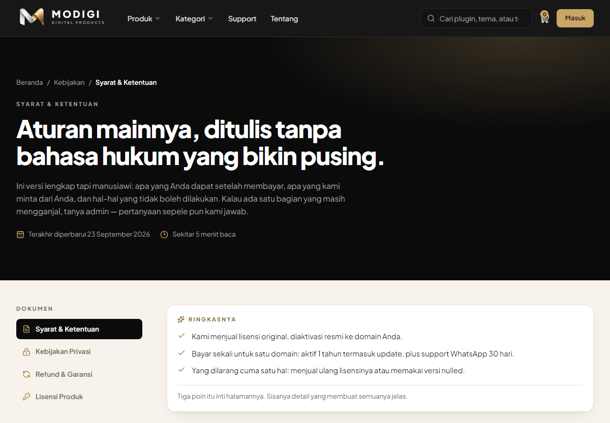

**Kategori & Testimoni** — halaman yang mengubah "belum tahu mau beli apa" dan
"boleh percaya nggak?" jadi langkah berikutnya

| Kategori | Testimoni |
| :---: | :---: |
| 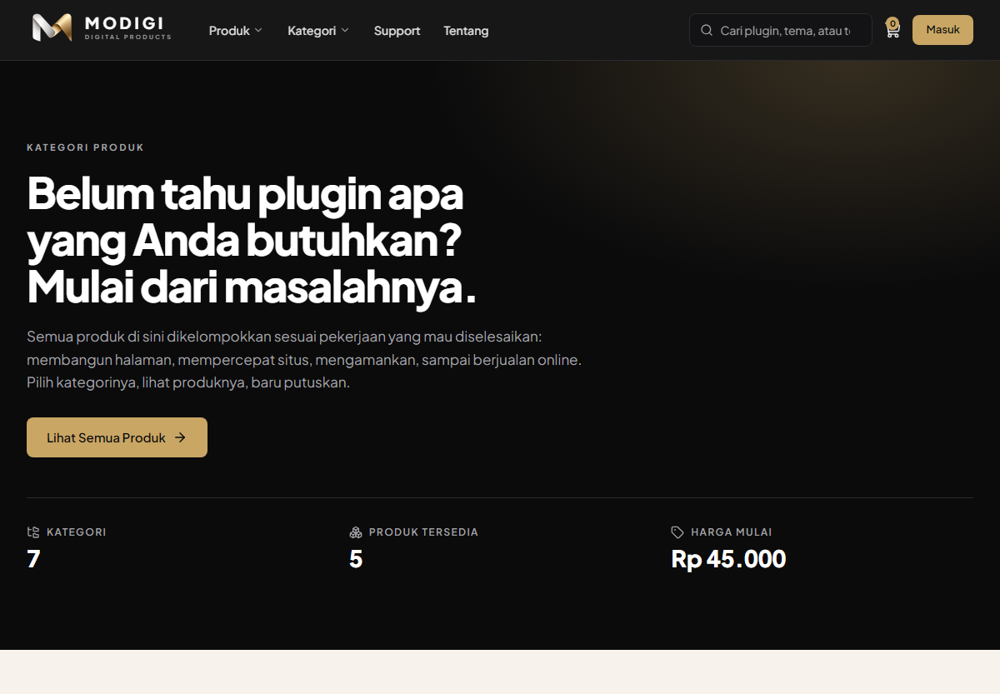 | 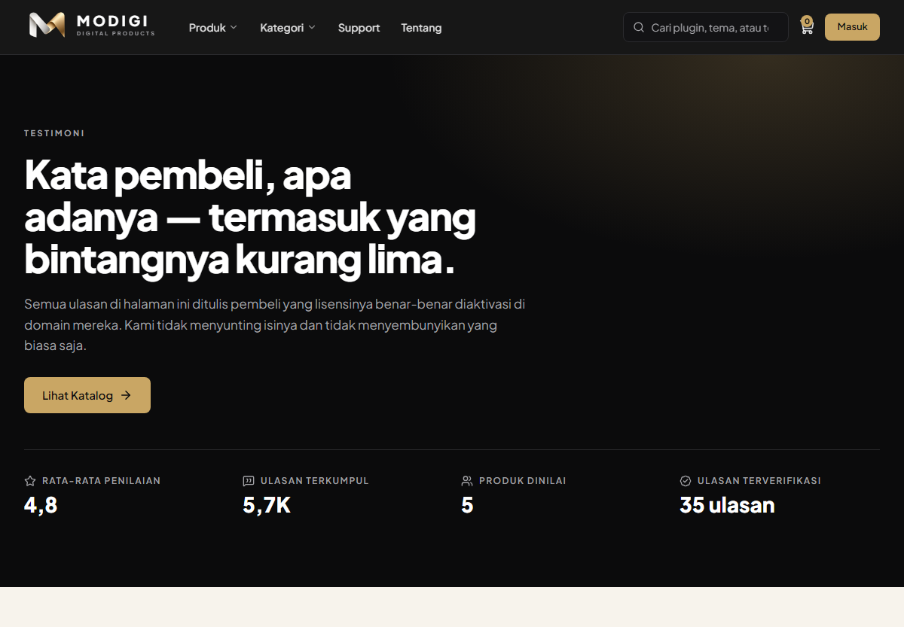 |

**Keranjang & Checkout** — dari "suka produknya" sampai konfirmasi pembayaran, tanpa akun

| Drawer keranjang | Halaman keranjang | Checkout |
| :---: | :---: | :---: |
| 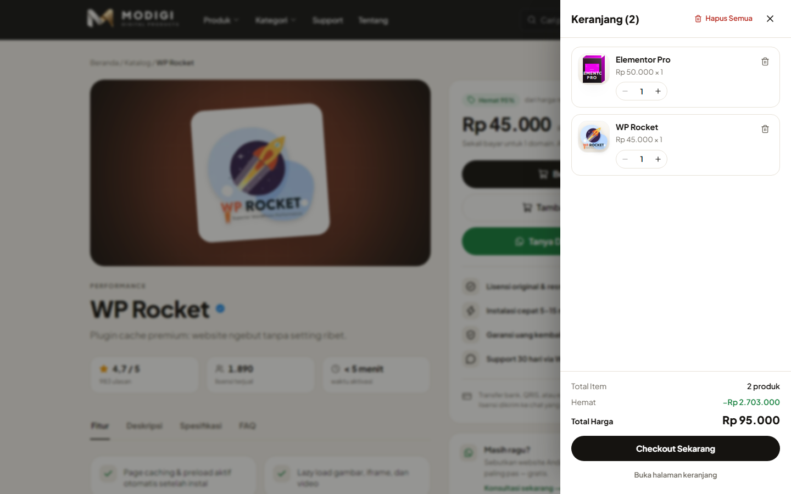 | 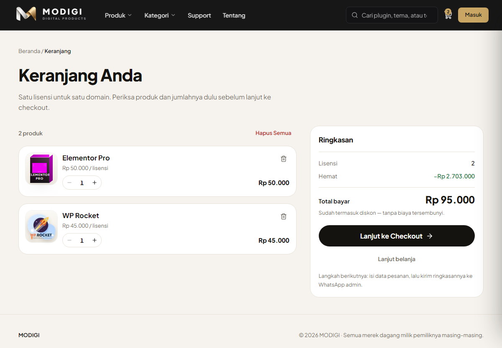 | 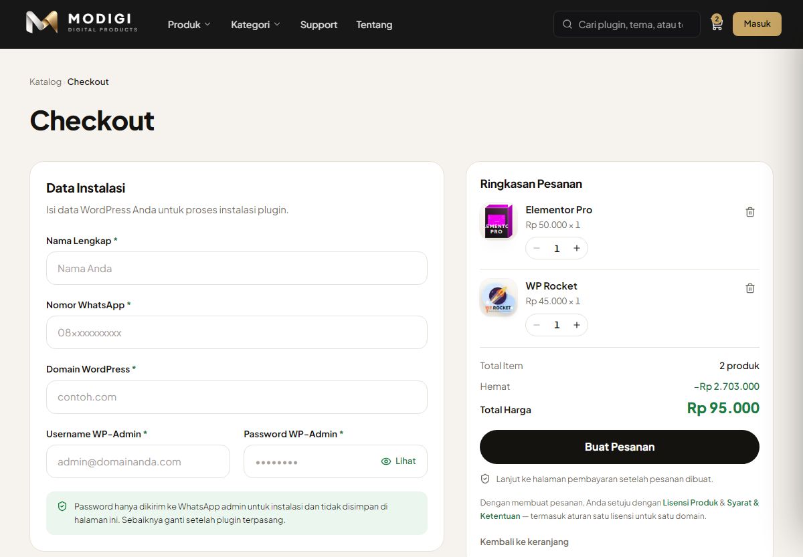 |

| Pembayaran (transfer bank & QRIS) |
| :---: |
| 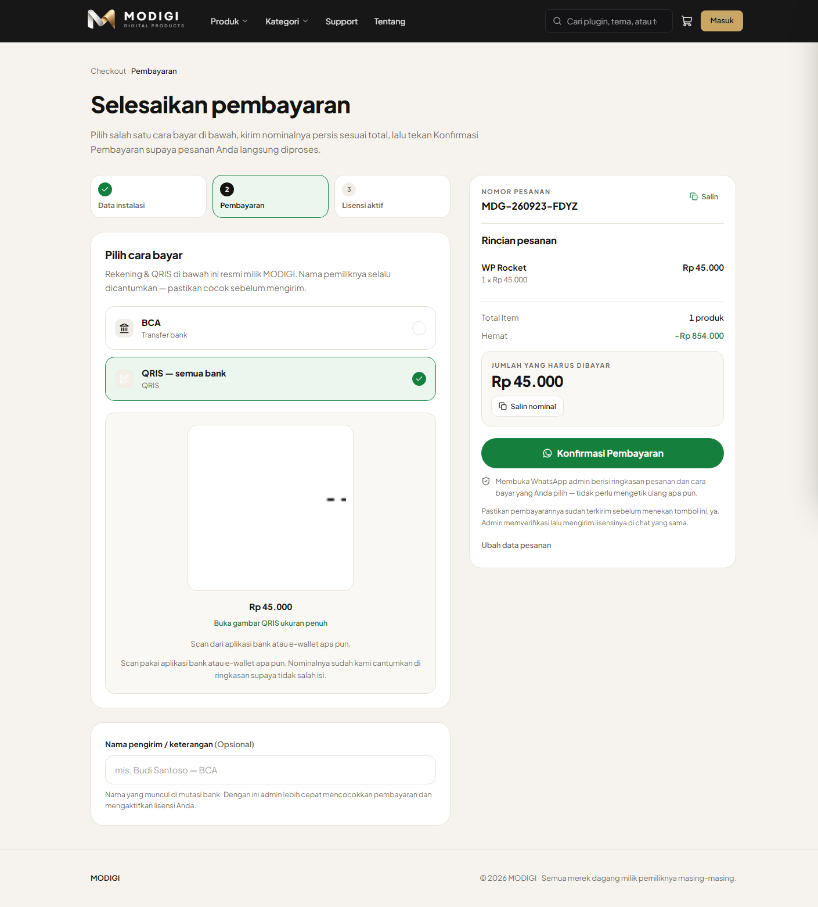 |

**Dashboard admin** — produk, kategori, pesanan, dan pembayaran; semua perubahan
langsung tayang di situs

| Dasbor | Daftar produk | Formulir produk |
| :---: | :---: | :---: |
| 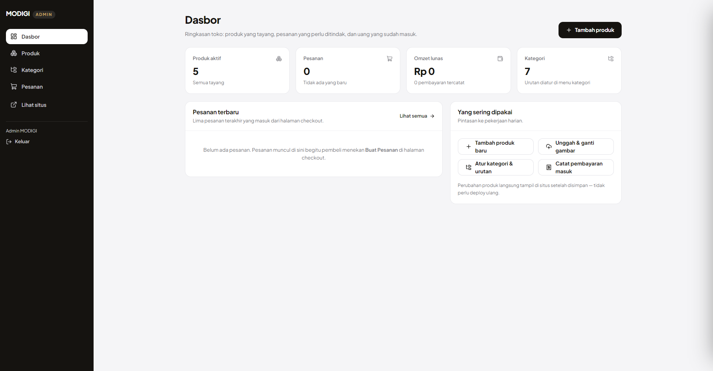 | 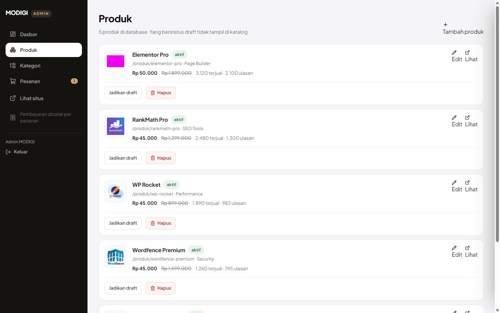 | 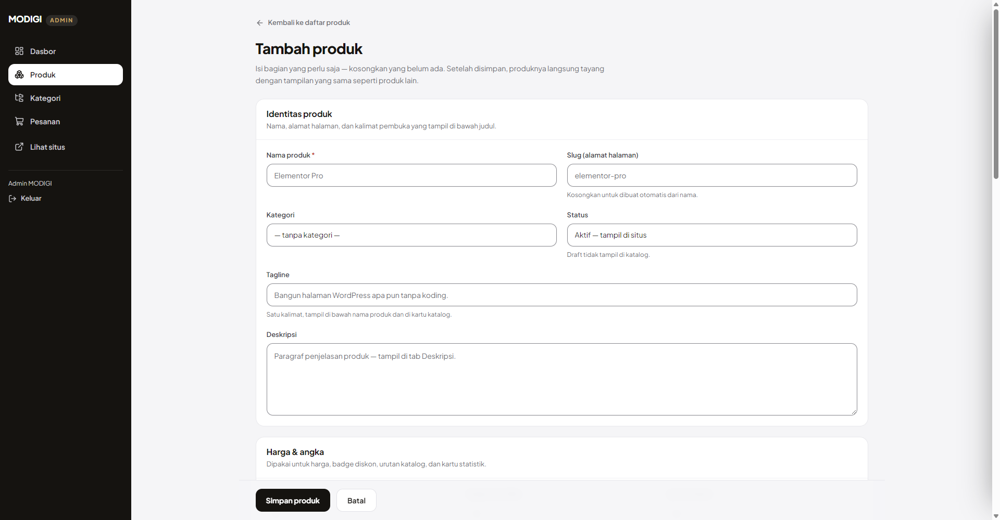 |

| Pesanan | Tampilan mobile |
| :---: | :---: |
| 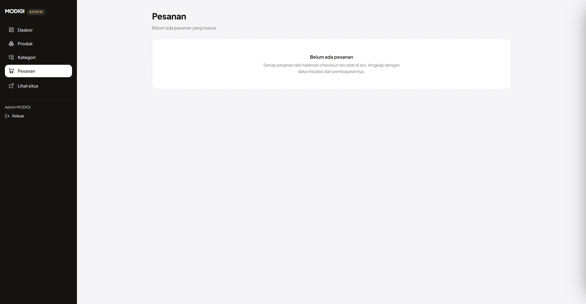 | 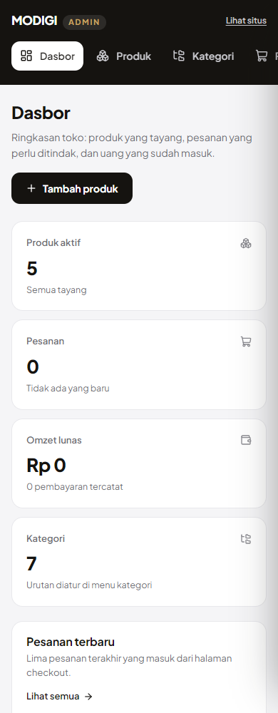 |

| Halaman | Deskripsi singkat |
| --- | --- |
| `/` | Hero + pencarian, baris kategori, produk terlaris, trust bar, CTA |
| `/produk` | Katalog: filter kategori, pencarian, urutan, kartu produk dengan badge diskon |
| `/produk/[slug]` | Detail: tab informasi, 3 kartu statistik, ulasan, buy box sticky, bar beli mobile |
| `/kategori` | Semua kategori dengan jumlah produk & harga mulai, plus daftar produknya |
| `/testimoni` | Ulasan dari semua produk, dikelompokkan per produk |
| `/keranjang` | Daftar item + ubah jumlah + ringkasan (hemat, total) |
| `/checkout` | Formulir data instalasi + ringkasan + persetujuan lisensi (belum mengirim WhatsApp) |
| `/checkout/pembayaran` | Pilih cara bayar (transfer bank / QRIS / e-wallet), lalu **Konfirmasi Pembayaran** mengirim pesanan lengkap + akses login ke WhatsApp |
| `/checkout/selesai` | Nomor pesanan, status pembayaran, rincian, langkah berikutnya |
| `/kebijakan/*` | Empat dokumen: Syarat & Ketentuan, Privasi, Refund, Lisensi |
| `/admin` | **Dashboard**: ringkasan angka + pesanan terbaru (tidak diindeks) |
| `/admin/produk` | Daftar produk: ubah status aktif/draft, edit, hapus |
| `/admin/produk/baru` · `/admin/produk/[id]` | Formulir produk: identitas, harga, foto (Cloudinary), isi halaman |
| `/admin/kategori` | Tambah/ubah/hapus kategori + urutannya |
| `/admin/pesanan` · `/admin/pesanan/[id]` | Pesanan masuk: data instalasi, status, pencatatan pembayaran |
| `/admin/pembayaran` | Nomor rekening, QRIS (unggah gambar), e-wallet + urutannya |
| `/admin/masuk` | Gerbang admin (satu password, sesi cookie httpOnly 12 jam) |

---

## Fitur

**Storefront**

- Katalog dengan **chip kategori, pencarian, dan urutan** (terlaris, rating, harga) —
  filter dibaca dari URL (`?q=`, `?kategori=`, `?urut=`) sehingga hasilnya bisa dibagikan
- Kartu produk: harga coret + chip diskon, rating, **seal verifikasi**, tombol keranjang
- Halaman detail: hero-stage artwork yang **ukurannya sama dengan kartu katalog**
  (88/152/164px — foto produk tampil seukuran di katalog maupun di detail),
  **3 kartu statistik**, tab
  **Fitur / Deskripsi / Spesifikasi / FAQ**, buy box yang menempel saat scroll,
  blok "Cara pesan", produk terkait, dan bar beli khusus mobile
- **Ulasan ala marketplace**: ringkasan rating + sebaran bintang, filter per bintang,
  tombol "lihat ulasan lainnya", badge pembelian terverifikasi
- **Drawer keranjang** — menekan "Tambah ke Keranjang" (atau ikon keranjang di
  header / FAB di tab bar) membuka panel dari kanan: ubah jumlah, hapus item,
  lihat total, lalu langsung ke checkout tanpa meninggalkan halaman yang dibaca
- **Keranjang** — isinya disimpan di `localStorage` (hanya slug + jumlah), badge
  jumlah di header & tab bar mobile ikut berubah tanpa reload
- **Checkout** — formulir **Data Instalasi** (nama, WhatsApp, domain, username &
  password WP-Admin), ringkasan pesanan yang menempel saat scroll, dan persetujuan
  lisensi. Menekan **Buat Pesanan** di sini **belum** membuka WhatsApp: pesanan
  dicatat, lalu pembeli diarahkan ke halaman pembayaran. Password WP-Admin hanya
  hidup di memori tab (tidak pernah ditulis ke `localStorage`) sampai konfirmasi
- **Pembayaran** — halaman `/checkout/pembayaran` menampilkan nomor rekening, nama
  pemilik, dan gambar QRIS yang diatur admin, lengkap dengan tombol **salin** untuk
  nomor rekening, nominal, dan nomor pesanan. Pembeli memilih satu metode, menekan
  **Konfirmasi Pembayaran**, dan **satu pesan WhatsApp** berangkat berisi semuanya:
  cara bayar, nominal, keterangan pengirim, rincian item, dan data instalasi
  **termasuk username + password WP-Admin** — admin bisa langsung memasang pluginnya
  tanpa menanyakan apa pun lagi
- **Konfirmasi pembayaran adalah pemicu kirim.** Karena WhatsApp baru dibuka di
  langkah itu, pesanan yang batal di tengah jalan tidak pernah sampai ke admin —
  yang masuk ke chat hanya pesanan yang benar-benar mau dibayar. Kalau halaman
  pembayaran dimuat ulang, password-nya (yang memang tidak disimpan) diminta sekali
  lagi di kartu ringkasan, jadi admin tetap menerima kredensialnya. Tombol
  "Tanya Dulu" juga tetap tersedia
- **Konfirmasi pesanan** — nomor pesanan, status pembayaran (sudah/belum
  dikonfirmasi + metodenya), rincian item, dan langkah berikutnya. Isinya dibaca
  dari `localStorage`, **bukan dari URL**, jadi nomor pesanan & data pembeli tidak
  tertinggal di riwayat browser

**Dashboard admin** (`/admin`, tidak diindeks mesin pencari)

- **Produk** — tambah/edit/hapus, unggah **foto produk ke Cloudinary** (berkas lama
  otomatis dihapus supaya kuota tidak menumpuk), atau tempel URL kalau gambarnya sudah
  ada di tempat lain. Ada juga tombol aktif/draft.
- **Formulir yang sama untuk produk baru dan produk lama** — artinya produk yang
  ditambah sendiri lewat dashboard tampil persis seperti produk lain: harga coret,
  kartu statistik, tab Fitur/Deskripsi/Spesifikasi/FAQ, produk terkait.
- **Formulirnya sengaja ringkas**: tidak ada kolom versi, tanggal update, atau warna
  box 3D — ketiganya tidak muncul di halaman detail produk, jadi memintanya cuma
  menambah pekerjaan. Kalau produknya belum punya foto, katalog memakai box 3D dari
  logo brand (satu-satunya kolom gambar cadangan yang tersisa).
- **Kategori** — tambah, ubah, hapus, atur urutan. Kategori yang masih dipakai
  produk tidak bisa dihapus (sistem yang mencegah, bukan peringatan).
- **Pesanan** — setiap checkout tercatat otomatis: data instalasi (nama, WhatsApp,
  domain, username WP-Admin), item, total, dan status bertahap
  (`baru → dikonfirmasi → dibayar → selesai`). Ada tombol langsung ke WhatsApp pembeli.
- **Cara bayar** — atur nomor rekening bank, QRIS (unggah gambarnya ke Cloudinary),
  dan e-wallet: mana yang tampil, urutannya, dan catatan untuk pembeli. Perubahan
  langsung terlihat di halaman pembayaran.
- **Pembayaran masuk** — catat transfer/QRIS/e-wallet per pesanan (boleh bertahap),
  lengkap dengan referensi & waktu lunas. Status pesanan naik sendiri ke **dibayar**
  begitu ada pembayaran lunas.
- **Dua hal yang sengaja dipisah**: menu *Cara bayar* mengatur rincian yang
  **ditampilkan** ke semua pembeli, menu *Pesanan* mencatat uang yang **benar-benar
  masuk** untuk satu pesanan.
- **Ubah produk → situs ikut berubah** tanpa deploy: server action admin memanggil
  `revalidatePath`, jadi halaman beranda/katalog/detail disegarkan saat itu juga.
- **Satu password, satu pengelola.** Sesi disimpan di cookie httpOnly bertanda tangan
  HMAC selama 12 jam; setiap server action memeriksa sesi sendiri, jadi penjagaan
  tidak bergantung pada tampilan halaman.

**Brand & bantuan**

- Beranda lengkap dengan showcase kategori dan trust bar
- **`/tentang`** — cerita, keunggulan, cara kerja, prinsip
- **`/bantuan`** — pusat bantuan 6 section ber-anchor (cara order, aktivasi, update,
  garansi, FAQ, kontak) yang ditautkan dari footer

**Fundamental**

- **Mobile shell ala aplikasi** di layar `< 1024px`: header dengan pembatas gelombang,
  hero ringkas (sapaan + pencarian), baris kategori, grid 2 kolom,
  bottom tab bar + tombol keranjang
- **Hero dua tampilan dari satu DOM**: mobile = panel cream ala aplikasi,
  desktop = panel gelap full-bleed dengan artwork. Isi desktop (eyebrow, chip
  pencarian populer, 4 statistik) disembunyikan di mobile dengan `lg:*`, bukan
  di-render ulang — jadi tidak ada duplikasi markup
- **SEO**: metadata per produk, halaman detail di-cache (ISR) dan disegarkan dari
  dashboard saat produknya berubah, breadcrumb, struktur heading berurutan
- **Aksesibilitas**: indikator fokus di semua elemen interaktif, ikon dekoratif
  `aria-hidden`, label untuk pembaca layar, target pointer ≥ 24px
- **Responsif terukur**: diuji di 320 / 375 / 768 / 1024 / 1280 / 1440 px dengan
  nol horizontal scroll

---

## Dashboard Admin

Masuk di **`/admin`** (otomatis diarahkan ke `/admin/masuk`) dengan `ADMIN_PASSWORD`.
Halaman-halaman dashboard tidak diindeks mesin pencari dan tidak memakai chrome situs.

```
/admin              dasbor: produk aktif, pesanan baru, omzet lunas, pesanan terbaru
/admin/produk       daftar produk — aktif/draft, edit, hapus
  ├─ /baru          formulir produk baru
  └─ /[id]          formulir produk yang sama + zona hapus
/admin/kategori     tambah, ubah, hapus, dan urutkan kategori
/admin/pesanan      daftar pesanan + detailnya
  └─ /[id]          data instalasi, status pesanan, catat pembayaran
/admin/pembayaran   nomor rekening, QRIS, e-wallet untuk halaman pembeli
```

**Tabel yang dipakai** (`supabase/schema.sql`)

| Tabel | Isi |
| --- | --- |
| `products` | Produk: harga, harga resmi, statistik, isi halaman, foto & logo Cloudinary, status |
| `categories` | Kategori + `sort_order` (urutan tampil di beranda) |
| `orders` | Pesanan: nomor, data pembeli, domain, username WP-Admin, total, status |
| `order_items` | Baris item per pesanan (nama, harga, jumlah, subtotal) |
| `payments` | Pembayaran per pesanan: metode, nominal, status, referensi, waktu lunas |
| `payment_methods` | Cara bayar yang **ditampilkan** ke pembeli: jenis, nomor & atas nama, QRIS (`qr_url`), aktif/nonaktif, urutan |

Semua tabel mengaktifkan **Row Level Security tanpa policy**: hanya `service_role`
(dipakai server Next.js) yang bisa membaca/menulis. Kalaupun anon key beredar, isi
toko — termasuk data pesanan pembeli — tetap tidak terbaca dari browser.

---

## Tumpukan

| Bagian | Dipakai |
| --- | --- |
| Framework | Next.js 16.3 (App Router, Server Components) |
| UI | React 19.2, Tailwind CSS v4, Lucide Icons |
| Bahasa | TypeScript 5 |
| Utilitas | `clsx` + `tailwind-merge` (helper `cn`) |
| Data | **Supabase (Postgres)** — `products`, `categories`, `orders`, `order_items`, `payments`, `payment_methods` (RLS aktif, hanya `service_role` yang bisa akses) |
| Gambar | **Cloudinary** — unggahan dari dashboard admin, tanpa SDK (signature SHA-1 sendiri) |
| Autentikasi | Password admin + cookie httpOnly bertanda tangan HMAC (`lib/admin-auth.ts`) |
| Seed & cadangan | `src/data/products.ts` & `data/categories.ts` — dipakai untuk mengisi database dan sebagai fallback kalau database tidak bisa dihubungi |
| Deploy | Vercel / Node.js (statis + halaman dinamis) |

---

## Menjalankan

Prasyarat: **Node.js 20+** dan npm.

```bash
npm install      # pasang dependensi
npm run dev      # jalankan di http://localhost:3000
npm run build    # production build + type checking
npm start        # jalankan hasil build
npm run lint     # ESLint
```

### Variabel environment

Buat `.env.local` (sudah di-`gitignore`) — nilainya bisa dilihat di dashboard
Supabase & Cloudinary masing-masing:

```ini
# Supabase (Project Settings → API)
NEXT_PUBLIC_SUPABASE_URL=https://xxxx.supabase.co
NEXT_PUBLIC_SUPABASE_ANON_KEY=eyJ…
SUPABASE_SERVICE_ROLE_KEY=eyJ…          # HANYA di server, jangan pernah diekspos ke klien

# Cloudinary (Dashboard → Product Environment Credentials)
CLOUDINARY_CLOUD_NAME=xxxx
CLOUDINARY_API_KEY=123456789012345
CLOUDINARY_API_SECRET=xxxx

# Dashboard admin
ADMIN_PASSWORD=pilih-password-panjang
ADMIN_SESSION_SECRET=teks-acak-panjang  # buat dengan: openssl rand -hex 32
```

Semua variabel di atas juga harus ada di **Vercel → Settings → Environment Variables**
(production & preview) supaya dashboard jalan di situs yang sudah deploy.

### Menyiapkan database

Jalankan `supabase/schema.sql` sekali di **SQL Editor Supabase** (atau lewat
Management API). Berkas itu aman dijalankan berulang: tabel, kolom tambahan, indeks,
trigger `updated_at`, dan RLS semuanya memakai `if not exists` / `create or replace`.

Kalau database masih kosong, situs tetap tampil memakai data statis di `src/data/`
(lihat `lib/catalog.ts`) — jadi tidak ada halaman blank saat setup belum lengkap.

---

---

## Struktur Proyek

```
src/
├─ app/
│  ├─ layout.tsx              # akar: font global + metadata saja
│  ├─ globals.css             # design token MODIGI (warna, font, shadow) via @theme
│  │
│  ├─ (main)/                 # chrome brand MODIGI (header, footer, tab bar mobile)
│  │  ├─ layout.tsx
│  │  ├─ page.tsx             # beranda — hanya menyusun urutan section
│  │  ├─ tentang/page.tsx     # halaman Tentang
│  │  ├─ kategori/page.tsx    # kategori + produk per kategori
│  │  ├─ testimoni/page.tsx   # ulasan lintas produk
│  │  └─ kebijakan/           # 4 dokumen kebijakan (satu kerangka yang sama)
│  │
│  └─ (store)/                # chrome store (tema cream/hijau)
│     ├─ layout.tsx
│     ├─ store.css            # tema store, di-scope ke `.store`
│     ├─ produk/
│     │  ├─ page.tsx          # katalog + filter dari search params
│     │  └─ [slug]/page.tsx   # detail produk (ISR 5 menit, disegarkan dari admin)
│     ├─ keranjang/page.tsx   # keranjang (isi dari localStorage)
│     ├─ checkout/
│     │  ├─ page.tsx          # formulir data instalasi + ringkasan
│     │  ├─ pembayaran/       # pilih cara bayar + konfirmasi ke WhatsApp
│     │  └─ selesai/page.tsx  # konfirmasi pesanan
│     └─ bantuan/page.tsx     # pusat bantuan
│
│  ├─ (admin)/admin/          # dashboard admin (tanpa chrome situs)
│  │  ├─ masuk/page.tsx       # gerbang password
│  │  └─ (panel)/             # semua halaman yang butuh sesi
│  │     ├─ layout.tsx        # penjagaan sesi + kerangka (sidebar, konten)
│  │     ├─ page.tsx          # dasbor: statistik + pesanan terbaru
│  │     ├─ produk/           # daftar, tambah, edit (+ hapus) produk
│  │     ├─ kategori/         # kelola kategori & urutannya
│  │     ├─ pesanan/          # daftar pesanan, detail, catat pembayaran
│  │     └─ pembayaran/       # nomor rekening, QRIS, e-wallet
│  │
│  └─ actions/                # server action: admin.ts (tulis) & pesanan.ts (checkout)
│
├─ components/
│  ├─ layout/                 # header, footer, tab bar mobile
│  ├─ home/                   # section khusus beranda
│  ├─ cart/                   # keranjang + pembayaran: hook, tombol, drawer, form
│  ├─ store/                  # komponen katalog & detail produk
│  ├─ admin/                  # dashboard: kerangka, formulir produk, tabel, tombol
│  ├─ kebijakan/              # kerangka dokumen kebijakan
│  └─ ui/                     # komponen kecil yang dipakai ulang
│
├─ assets/
│  ├─ logo-mark.png, hero-background.png
│  ├─ verified-badge.png      # seal verifikasi (dipakai di kartu, judul, ulasan)
│  ├─ products/               # foto produk
│  └─ brands/                 # logo RESMI tiap plugin (dipakai apa adanya)
│
├─ data/                      # konten halaman + data awal (seed) katalog
│  ├─ site.ts                 # hero, statistik, trust bar, CTA
│  ├─ navigation.ts           # menu header, kolom footer, social media
│  ├─ categories.ts           # kategori awal (dipakai untuk mengisi database)
│  ├─ products.ts             # produk awal — dipakai sebagai seed & fallback
│  ├─ reviews.ts              # ulasan per produk + sebaran bintang
│  ├─ store.ts                # nomor WhatsApp + teks katalog & buy box
│  ├─ about.ts, support.ts    # copy halaman Tentang & Bantuan
│  ├─ policies.ts             # isi 4 dokumen kebijakan
│  └─ ...
│
├─ lib/                       # helper: cn, format, link WhatsApp, katalog, Cloudinary, Supabase
└─ types/                     # tipe data bersama

supabase/
└─ schema.sql                 # tabel, indeks, trigger updated_at, RLS (jalankan sekali)

public/
├─ brands/                    # logo resmi plugin (dipakai muka box produk)
└─ products/                  # foto produk
```

Prinsipnya: **komponen mengurus tampilan, database mengurus isi.** Teks jualan
(bukan katalog) tetap di `src/data/` supaya satu klaim hanya hidup di satu tempat;
sedangkan produk & kategori diubah dari dashboard admin.

---

## Route & Halaman

| Route | Rendering | Keterangan |
| --- | --- | --- |
| `/` | Static + revalidate | Beranda brand MODIGI (disertakan data katalog terbaru) |
| `/tentang` | Static | Cerita, keunggulan, cara kerja, prinsip |
| `/produk` | Dynamic | Katalog + filter kategori/pencarian/urutan, dibaca dari database |
| `/produk/[slug]` | **ISR (5 menit)** | Detail produk — disegarkan langsung saat produknya diedit di dashboard |
| `/bantuan` | Static | Pusat bantuan (6 section ber-anchor) |
| `/kategori` | Static + revalidate | Kategori + produk per kategori, dihitung dari database |
| `/keranjang` | Static + klien | Isi keranjang dari `localStorage` (tidak diindeks) |
| `/checkout` | Static + klien | Formulir data instalasi + ringkasan pesanan (tidak diindeks) |
| `/checkout/pembayaran` | Static + revalidate | Cara bayar dari database, disegarkan saat admin mengubahnya (tidak diindeks) |
| `/checkout/selesai` | Static + klien | Konfirmasi pesanan terakhir (tidak diindeks) |
| `/testimoni` | Static | Ulasan lintas produk dari satu sumber data yang sama |
| `/kebijakan/syarat-ketentuan` | Static | Syarat & Ketentuan — 9 bagian |
| `/kebijakan/privasi` | Static | Kebijakan Privasi — 9 bagian |
| `/kebijakan/refund` | Static | Refund & Garansi — 7 bagian |
| `/kebijakan/lisensi` | Static | Lisensi Produk — 8 bagian |
| `/icon.png`, `/apple-icon.png` | Static | Favicon & ikon home screen iOS |

---

## Mengubah Konten

| Mau ubah apa | Edit di |
| --- | --- |
| Warna, radius, shadow, font | `src/app/globals.css` (blok `@theme`) |
| Teks hero, statistik, trust bar, CTA | `src/data/site.ts` |
| Menu header & link footer | `src/data/navigation.ts` |
| **Produk** (harga, foto, isi halaman) | **`/admin/produk`** — dashboard, tanpa deploy |
| **Kategori** | **`/admin/kategori`** |
| **Pesanan & pembayaran masuk** | **`/admin/pesanan`** |
| **Nomor rekening & QRIS** | **`/admin/pembayaran`** — dashboard, tanpa deploy |
| Produk awal (seed) / kalau database mati | `src/data/products.ts` |
| Kategori awal (seed) | `src/data/categories.ts` |
| **Ulasan pembeli** | `src/data/reviews.ts` (produk tanpa data ulasan otomatis tidak menampilkan section) |
| **Nomor WhatsApp toko** | `src/data/store.ts` → `whatsappNumber` |
| Teks katalog, buy box, poin trust | `src/data/store.ts` |
| Teks keranjang / checkout / pembayaran / konfirmasi | `src/data/store.ts` → `cartCopy`, `checkoutCopy`, `paymentCopy`, `orderDoneCopy` |
| Copy halaman Tentang / Bantuan | `src/data/about.ts`, `src/data/support.ts` |
| Copy halaman Kategori / Testimoni | `src/data/kategori.ts`, `src/data/testimoni.ts` |
| **Teks 4 dokumen kebijakan** | `src/data/policies.ts` (satu dokumen = satu objek) |
| Urutan section beranda | `src/app/(main)/page.tsx` |
| Tema halaman store (cream/hijau) | `src/app/(store)/store.css` |

### Menambah produk

Cara normal: buka **`/admin/produk/baru`**, isi formulirnya, lalu **Simpan**. Foto
produk dan logo resminya diunggahkan ke Cloudinary dari formulir yang sama. Produk
baru langsung tayang di katalog, beranda, halaman kategori, dan punya halaman
detailnya sendiri — semuanya tanpa deploy.

Kalau mau menambah lewat kode (mis. saat menyiapkan database baru), bentuknya seperti
ini — setelah itu jalankan seed supaya masuk ke database:

```ts
// src/data/products.ts
{
  slug: "wpml-multilingual",
  name: "WPML Multilingual",
  categorySlug: "utility",     // harus ada di data/categories.ts
  price: 55_000,
  compareAt: 1_200_000,        // harga resmi → dasar harga coret & badge diskon
  rating: 4.7,
  reviews: 320,
  sold: 410,
  version: "4.6.x",
  updated: "12 Sep 2026",
  art: {
    label: "WPML",
    from: "#FFFFFF",           // gradient muka box
    to: "#E7F0FA",
    accent: "#2E7DD1",         // sisi + bibir box
    logo: wpmlLogo,            // logo resmi, taruh di src/assets/brands/
  },
  // …highlights, description, specs, faq
}
```

---

## Sistem Desain

Dua identitas visual dalam satu aplikasi, dipisah lewat **route group**:

| | Brand `(main)` | Store `(store)` |
| --- | --- | --- |
| Nuansa | Gelap + cream + emas | Cream + aksen hijau |
| Token | `@theme` di `globals.css` | Variabel CSS di `store.css` (scope `.store`) |
| Dipakai di | Beranda, Tentang, Kebijakan | Katalog, detail produk, Bantuan |

**Token global** (`src/app/globals.css`)

| Peran | Nilai |
| --- | --- |
| `ink` / `ink-700` | `#0b0b0c` / `#1b1b1e` — latar gelap & teks utama |
| `cream` / `cream-200` / `sand` | `#f7f3ec` / `#efe9dd` / `#ece3d2` — latar terang |
| `gold` / `gold-soft` / `gold-deep` | `#c9a664` / `#e2cb9c` / `#a3803c` — aksen brand (ikon, garis, latar) |
| `gold-ink` | `#7d5f28` — emas khusus **teks kecil di latar terang**: 5,4:1 di atas cream, sedangkan `gold-deep` hanya 3,3:1 (gagal WCAG AA) |
| `line` / `line-dark` | `#e7dfd1` / `#2b2b2e` — garis |
| `muted` / `muted-dark` | `#6f675b` / `#a2a2a6` — teks sekunder |
| `shadow-card` / `shadow-lift` | Elevasi kartu & hover |

**Token store** (`src/app/(store)/store.css`): `--bg`, `--surface`, `--ink`,
`--muted`, `--line`, `--accent` (`#15803d`), `--accent-soft`, `--amber`, `--radius`.

Tipografi memakai **Plus Jakarta Sans** lewat `next/font` (self-hosted, tanpa request
ke Google, tanpa layout shift) untuk seluruh situs — konsistensi brand lebih penting
daripada font display terpisah per halaman.

---

## Catatan Teknis

Beberapa keputusan yang sengaja diambil, dan alasannya:

1. **Dua chrome lewat route group.** `(main)` dan `(store)` punya layout, tema, dan
   CSS sendiri tanpa saling bocor — `store.css` di-scope ke `.store` supaya tidak
   menimpa gaya halaman brand.
2. **Filter katalog dibaca di server** dari `?q=`, `?kategori=`, `?urut=`; hanya
   bagian yang butuh interaksi (filter bintang di ulasan, tab produk) yang jadi
   Client Component. Hasil filter tetap bisa dibagikan dan dirender di server.
3. **Aset di-`import`, bukan path mentah.** URL-nya ber-hash konten, jadi menimpa
   file gambar langsung membatalkan cache browser — tanpa rename atau hard refresh.
4. **Logo brand pihak ketiga dipakai apa adanya** (tidak di-recolor, tidak digambar
   ulang) dan diambil dari kanal resmi vendor. Warna box disesuaikan lewat properti
   `tone` supaya logonya tetap kontras, bukan logonya yang diubah.
5. **Katalog dibaca dari database, dengan cadangan statis.** `lib/catalog.ts`
   mengambil produk & kategori dari Supabase, dan kalau databasenya belum diisi
   atau tidak bisa dihubungi, yang tampil adalah isi `src/data/products.ts` — jadi
   tidak ada halaman kosong. Query-nya dibungkus `cache()` React supaya satu request
   tidak menembak database berkali-kali hanya karena layout, kartu, dan drawer
   meminta data yang sama.
6. **Klaim & copy dipisah dari komponen.** Semua teks jualan ada di `src/data/`,
   memakai aturan: satu klaim hanya punya satu nilai di seluruh situs.
7. **UI diverifikasi dengan pengukuran**, bukan perkiraan: Chrome headless dipakai
   untuk memeriksa overflow horizontal, ukuran target sentuh, ukuran artwork, dan
   panjang baris teks di banyak lebar layar selama pengembangan.
8. **Hero mobile dipisah; dua blok promo dihapus.** Mobile memakai hero ringkas
   (sapaan + judul + pencarian) di latar cream, desktop memakai panel gelap dengan
   artwork. Banner promo geser dan kartu kode promo pernah dicoba di beranda mobile,
   keduanya dibuang: terlalu banyak konten berdesakan di satu layar kecil. Efeknya
   mobile langsung masuk ke baris kategori setelah kolom pencarian.
9. **Keranjang memakai `localStorage` sebagai store, dibaca lewat
   `useSyncExternalStore`** (`lib/cart.ts` + `components/cart/use-cart.ts`). Jadi
   tidak ada provider/context yang perlu dipasang: header, tab bar mobile, halaman
   keranjang, dan checkout semuanya membaca angka yang sama, dan tab lain yang
   mengubah keranjang pun ikut tersinkron. Mengubah isi keranjang membuat React
   otomatis render ulang semua yang membacanya.
   Yang disimpan hanya `slug` + jumlah — harga selalu diambil ulang dari katalog,
   sehingga tidak pernah ada harga basi yang tertinggal di browser pembeli.
   Status buka/tutup drawer juga store terpisah (`useCartDrawer`), supaya tombol di
   halaman produk, ikon di header, dan FAB di tab bar mobile bisa membuka panel yang
   sama tanpa saling mengirim prop.
10. **Checkout tidak pernah gagal karena server.** Pesanan disimpan di
   `localStorage` (dibaca halaman konfirmasi), dikirim ke WhatsApp admin saat
   konfirmasi pembayaran, dan **juga** dicatat ke database lewat server action
   `buatPesananAction`. Pencatatan ke database sengaja tidak ditunggu: WhatsApp
   adalah jalur utama pesanannya, jadi kalau penyimpanan di server bermasalah,
   pembeli tetap bisa menyelesaikan order.
   Kalau database tidak bisa dihubungi, hal yang sama juga berlaku untuk rincian
   cara bayar: halaman pembayaran menyebut apa adanya bahwa rekeningnya dikirim
   admin lewat chat, bukan menampilkan nomor contoh yang bisa disalahgunakan.
11. **Satu pesan WhatsApp, dikirim saat pembeli menekan Konfirmasi Pembayaran.**
   Isinya digabung supaya admin tidak perlu menyusun sendiri: cara bayar, nominal,
   keterangan pengirim, rincian pesanan, dan data instalasi **termasuk password
   WP-Admin**. Efek sampingnya yang justru diinginkan: chat hanya berisi pesanan
   yang serius mau dibayar — pesanan yang ditinggalkan di tengah jalan tidak pernah
   mengirim apa pun. Rincian cara bayar sendiri **tidak diketik ulang** oleh
   pembeli: isinya datang dari tabel `payment_methods` yang diatur admin, jadi
   halaman pembeli selalu memakai nomor rekening terbaru tanpa deploy ulang.
12. **Password WP-Admin tidak disimpan di mana pun.** Formulir checkout meminta
   kredensial WP-Admin (dipakai admin untuk memasang pluginnya), tapi
   `createOrder()` sengaja tidak memasukkannya ke objek pesanan, dan tabel `orders`
   memang **tidak punya kolomnya** (lihat `supabase/schema.sql`). Di antara dua
   halaman, password dipegang **variabel modul** (`simpanPasswordInstalasi`) — bukan
   `localStorage`/`sessionStorage`, jadi tidak ada yang tertulis ke disk dan
   nilainya hilang begitu tab ditutup. Konsekuensinya ditangani, bukan disembunyikan:
   kalau halaman pembayaran dimuat ulang, memori itu kosong dan field password
   muncul sendiri di kartu ringkasan, wajib diisi sebelum tombol konfirmasi jalan.
   Dashboard admin pun tidak menampilkannya — yang tersimpan hanya username.
   Halaman konfirmasi & formulir memberi catatan agar password diganti setelah
   plugin terpasang. Kalau keamanan jadi prioritas, langkah berikutnya adalah akun
   WP sementara atau tautan instalasi sekali-pakai — sudah masuk daftar di bawah.
12. **Drawer keranjang memakai `inert` saat tertutup.** Panel yang cuma digeser ke
   luar layar tetap bisa di-Tab — jadi panelnya benar-benar dimatikan (bukan sekadar
   transparan), `Escape` menutup, fokus dipindah ke panel saat dibuka dan
   dikembalikan ke tombol pemicunya saat ditutup, dan scroll halaman dikunci selama
   panel terbuka.
13. **Empat dokumen kebijakan memakai satu kerangka** (`components/kebijakan/`).
   Isinya di `data/policies.ts`, jadi menambah dokumen kelima cukup menambah satu
   objek + satu `page.tsx` sebaris. Navigasi (pindah dokumen & daftar isi) memakai
   `<details>` di mobile, jadi seluruh halaman jalan tanpa JavaScript, dan setiap
   bagian diberi nomor supaya bisa dirujuk ("lihat bagian 4").
14. **Harga di keranjang datang dari server, bukan dari data statis.** Keranjang
   hanya menyimpan `slug` + jumlah, sedangkan harga & artwork-nya dikirim server
   lewat `<CatalogSync />` (satu `<div hidden>`, bukan provider/context). Jadi
   setelah admin mengubah harga di dashboard, isi keranjang pembeli ikut memakai
   harga baru — tidak ada harga lama yang tertinggal di browser. Selama ringkasan
   itu belum sampai, halaman keranjang menampilkan kerangka (bukan harga tebakan).
15. **Satu password untuk dashboard, sesi di cookie bertanda tangan.** Produk ini
   hanya punya satu pengelola, jadi tabel user + reset password hanya menambah hal
   yang bisa bocor tanpa menambah keamanan nyata. Sesi = cookie httpOnly berisi
   `kedaluwarsa.tandaTangan` (HMAC-SHA256, 12 jam), dan **setiap server action
   memeriksa sesi sendiri** — Server Action bisa dipanggil tanpa melewati tampilan,
   jadi penjagaan tidak boleh hanya ada di halaman.
16. **Unggah Cloudinary tanpa SDK.** Yang dibutuhkan cuma dua panggilan REST
   (upload & destroy) dengan signature SHA-1 dari `node:crypto`, jadi tidak ada
   dependensi tambahan yang perlu dirawat. `public_id` setiap gambar disimpan di
   database supaya berkas lama ikut dihapus saat diganti — tanpa itu, kuota
   Cloudinary menumpuk tanpa terasa.
17. **`revalidate` + `revalidatePath` untuk halaman produk.** Pengunjung dilayani
   dari cache (bukan query database tiap kali halaman dibuka), tapi begitu admin
   menyimpan perubahan, halaman terkait disegarkan saat itu juga — jadi tidak ada
   jeda "kok belum berubah?" setelah edit.

---

## Yang Perlu Diputuskan Sebelum Dipakai

Isi keempat dokumen sudah lengkap dan konsisten dengan klaim di halaman lain, tapi
beberapa hal masih memakai nilai default dan **harus dikonfirmasi pemilik toko**.
Semuanya sudah ditandai `← PERLU DIPUTUSKAN` di `src/data/policies.ts`:

| Hal | Nilai sekarang | Ada di |
| --- | --- | --- |
| **Nomor rekening & QRIS** | Daftar metode di dashboard admin (`/admin/pembayaran`); database **dibuat kosong**, jadi wajib diisi sebelum dipakai jualan | `payment_methods` |
| **Kredensial WP-Admin** | Diminta di checkout, ikut terkirim di pesan konfirmasi pembayaran (tidak disimpan) | `data/store.ts` → `checkoutCopy.passwordNote` |
| **Password dashboard admin** | `ADMIN_PASSWORD` di environment variable — ganti dari nilai contoh | Vercel & `.env.local` |
| **Data pesanan tersimpan di server** | Ya: nama, WhatsApp, domain, username WP-Admin, item, pembayaran | Supabase (`orders`, `order_items`, `payments`) |
| **Cara bayar yang tampil ke pembeli** | Nomor rekening, nama pemilik, gambar QRIS — diatur admin, bukan ditulis di kode | Supabase (`payment_methods`) + Cloudinary |
| **Pihak yang menyimpan data** | Supabase (database), Cloudinary (foto produk), WhatsApp (chat) | Kebijakan Privasi → "Siapa lagi yang bisa melihat data Anda" |
| Identitas badan hukum & alamat | **belum dicantumkan** — hanya brand MODIGI | seluruh dokumen |
| Lama penyimpanan data pesanan | 12 bulan setelah masa aktif | Kebijakan Privasi → “Berapa lama data disimpan” |
| SLA permintaan data pembeli | balasan 1×24 jam, proses maks. 7 hari kerja | Kebijakan Privasi → “Hak Anda” |
| Waktu proses refund | disetujui 1×24 jam, dana 1–3 hari kerja | Refund & Garansi → “Berapa lama uangnya kembali” |
| Konsekuensi pelanggaran lisensi | lisensi bisa dinonaktifkan tanpa refund | Syarat & Ketentuan → “Yang tidak boleh dilakukan” |
| Kustomisasi kode khusus | tidak termasuk dalam lisensi | Lisensi Produk → “Yang tidak termasuk” |

Nomor WhatsApp, email (`halo@modigi.id`), jam operasional, dan seluruh angka klaim
(masa aktif 1 tahun, support 30 hari, garansi 7 hari) diambil dari `store.ts` &
`support.ts` — jadi satu nilai hanya hidup di satu tempat.

---

## Roadmap

- [x] **Keranjang** — `localStorage` + badge jumlah hidup di header & FAB mobile
- [x] **Halaman `/keranjang`** — ubah jumlah, hapus item, ringkasan, hemat
- [x] **Halaman `/checkout`** — data instalasi + domain, ringkasan, persetujuan lisensi
- [x] **Halaman `/checkout/pembayaran`** — transfer bank / QRIS / e-wallet dari
      dashboard, tombol salin, dan konfirmasi pembayaran yang mengirim pesanan
      lengkap (termasuk akses login) dalam satu pesan WhatsApp
- [x] **Konfirmasi pesanan** — nomor pesanan, status pembayaran, rincian, langkah berikutnya
- [x] **Halaman `/kategori` & `/testimoni`** — semua tautan header & footer hidup
- [x] **Dashboard admin** — produk, kategori, pesanan, pembayaran, unggah Cloudinary
- [x] **Database** — katalog & pesanan pindah dari data statis ke Supabase
- [ ] **Payment gateway** — QRIS/transfer otomatis, bukan konfirmasi manual di chat
- [ ] **Bukti transfer dari pembeli** — pembeli sudah mengonfirmasi lewat WhatsApp,
      tapi catatan pembayarannya masih diisi admin di dashboard (belum otomatis masuk
      sebagai pembayaran berstatus *pending* di pesanannya)
- [ ] **Akun pelanggan** — riwayat lisensi & perpanjangan (tombol "Masuk" masih
      mengarah ke `/masuk` yang belum ada)
- [ ] **Beberapa pengguna admin** — sekarang satu password; langkah berikutnya
      Supabase Auth dengan peran (owner/staf)
- [ ] **Pengingat masa aktif lisensi** — email/WhatsApp otomatis sebelum 1 tahun habis
- [ ] **Blog/artikel** untuk kebutuhan SEO

---

## Lisensi

Kode di repo ini dilisensikan **MIT** — lihat [LICENSE](LICENSE).

Aset pihak ketiga tidak termasuk dalam lisensi tersebut: nama dan logo produk
(Elementor, WP Rocket, Wordfence, Rank Math, Essential Addons, dan lainnya) adalah
merek dagang milik pemiliknya masing-masing, dipakai hanya untuk keperluan
identifikasi produk yang dijual.
