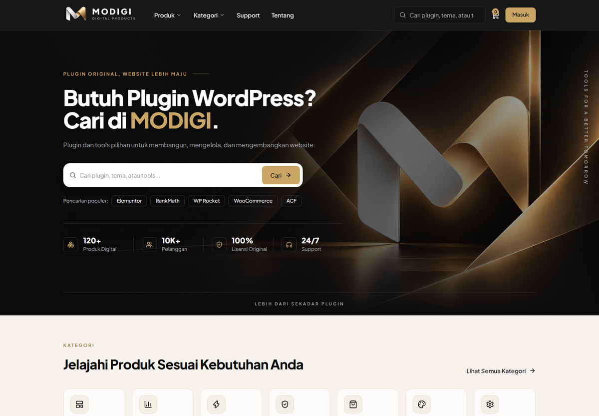
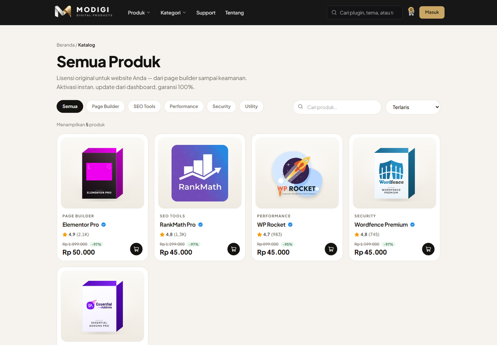
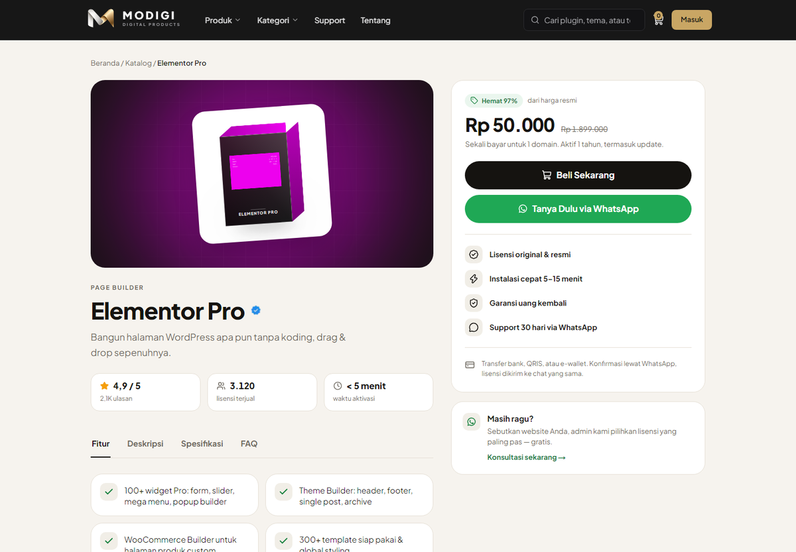
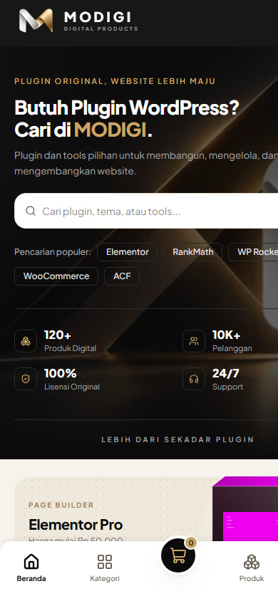
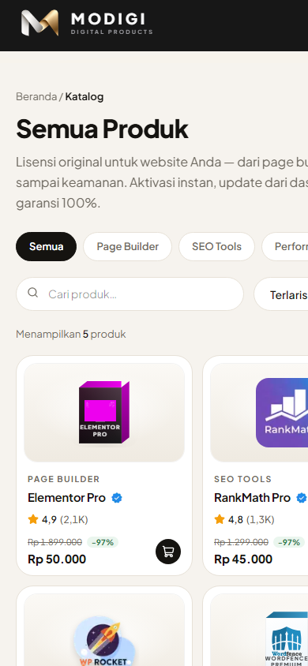
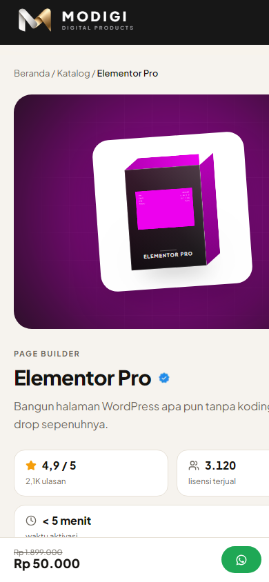
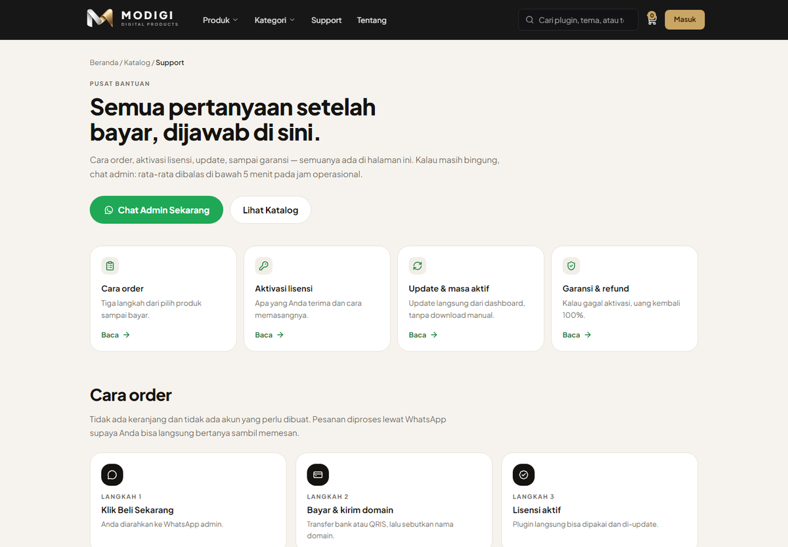

# MODIGI — Digital Products Storefront

Storefront produk digital (lisensi plugin & tema WordPress) — katalog, halaman detail
produk dengan ulasan pelanggan, dan alur checkout via WhatsApp.

Dibangun dengan **Next.js 16 (App Router)**, **TypeScript**, dan **Tailwind CSS v4**.


> **Catatan:** ini proyek portofolio. Data produk, harga, ulasan, dan nomor WhatsApp
> di repo ini adalah **contoh** — bukan toko yang sedang berjalan. Logo produk pihak
> ketiga (Elementor, WP Rocket, Wordfence, Rank Math, Essential Addons) tetap milik
> pemiliknya masing-masing dan dipakai apa adanya.

---

## Daftar Isi

- [Preview](#preview)
- [Fitur](#fitur)
- [Tumpukan](#tumpukan)
- [Menjalankan](#menjalankan)
- [Struktur Proyek](#struktur-proyek)
- [Route & Halaman](#route--halaman)
- [Mengubah Konten](#mengubah-konten)
- [Sistem Desain](#sistem-desain)
- [Catatan Teknis](#catatan-teknis)
- [Roadmap](#roadmap)
- [Lisensi](#lisensi)

---

## Preview

**Desktop**

| Beranda | Katalog | Detail produk |
| :---: | :---: | :---: |
|  |  |  |

**Mobile** — hero tampil identik dengan desktop (panel gelap + artwork), lalu banner promo geser,
grid 2 kolom, dan bottom tab bar + tombol keranjang ala aplikasi

<p align="center">
  
  
  
</p>

**Pusat bantuan** — 6 section ber-anchor yang ditautkan dari footer



| Halaman | Deskripsi singkat |
| --- | --- |
| `/` | Hero + pencarian, banner promo, baris kategori, produk terlaris, trust bar, CTA |
| `/produk` | Katalog: filter kategori, pencarian, urutan, kartu produk dengan badge diskon |
| `/produk/[slug]` | Detail: tab informasi, 3 kartu statistik, ulasan, buy box sticky, bar beli mobile |

---

## Fitur

**Storefront**

- Katalog dengan **chip kategori, pencarian, dan urutan** (terlaris, rating, harga) —
  filter dibaca dari URL (`?q=`, `?kategori=`, `?urut=`) sehingga hasilnya bisa dibagikan
- Kartu produk: harga coret + chip diskon, rating, **seal verifikasi**, tombol keranjang
- Halaman detail: hero-stage artwork, **3 kartu statistik**, tab
  **Fitur / Deskripsi / Spesifikasi / FAQ**, buy box yang menempel saat scroll,
  blok "Cara pesan", produk terkait, dan bar beli khusus mobile
- **Ulasan ala marketplace**: ringkasan rating + sebaran bintang, filter per bintang,
  tombol "lihat ulasan lainnya", badge pembelian terverifikasi
- **Alur order WhatsApp**: tombol beli & tanya otomatis mengisi pesan berisi nama
  produk dan harganya (tanpa akun, tanpa keranjang yang belum selesai)

**Brand & bantuan**

- Beranda lengkap dengan promo carousel, showcase kategori, dan trust bar
- **`/tentang`** — cerita, keunggulan, cara kerja, prinsip
- **`/bantuan`** — pusat bantuan 6 section ber-anchor (cara order, aktivasi, update,
  garansi, FAQ, kontak) yang ditautkan dari footer

**Fundamental**

- **Mobile shell ala aplikasi** di layar `< 1024px`: menu panel, banner promo geser,
  baris kategori, grid 2 kolom, bottom tab bar + tombol keranjang
- **Satu hero untuk semua layar**: isi hero (eyebrow, judul, pencarian, chip populer,
  4 statistik) tidak berbeda antara mobile dan desktop — yang berubah hanya
  skala tipografi dan kerapatan jarak
- **SEO**: metadata per produk, halaman detail **ter-prerender saat build**,
  breadcrumb, struktur heading berurutan
- **Aksesibilitas**: indikator fokus di semua elemen interaktif, ikon dekoratif
  `aria-hidden`, label untuk pembaca layar, target pointer ≥ 24px
- **Responsif terukur**: diuji di 320 / 375 / 768 / 1024 / 1280 / 1440 px dengan
  nol horizontal scroll

---

## Tumpukan

| Bagian | Dipakai |
| --- | --- |
| Framework | Next.js 16.3 (App Router, Server Components) |
| UI | React 19.2, Tailwind CSS v4, Lucide Icons |
| Bahasa | TypeScript 5 |
| Utilitas | `clsx` + `tailwind-merge` (helper `cn`) |
| Data | File statis di `src/data/` — **tanpa database, tanpa API key** |
| Deploy | Vercel / Node.js (statis + beberapa halaman dinamis) |

---

## Menjalankan

Prasyarat: **Node.js 20+** dan npm.

```bash
npm install      # pasang dependensi
npm run dev      # jalankan di http://localhost:3000
npm run build    # production build + type checking
npm start        # jalankan hasil build
npm run lint     # ESLint
```

Tidak ada variabel environment yang dibutuhkan — semua konfigurasi toko ada di
`src/data/store.ts`.

---

## Struktur Proyek

```
src/
├─ app/
│  ├─ layout.tsx              # akar: font global + metadata saja
│  ├─ globals.css             # design token MODIGI (warna, font, shadow) via @theme
│  │
│  ├─ (main)/                 # chrome brand MODIGI (header, footer, tab bar mobile)
│  │  ├─ layout.tsx
│  │  ├─ page.tsx             # beranda — hanya menyusun urutan section
│  │  └─ tentang/page.tsx     # halaman Tentang
│  │
│  └─ (store)/                # chrome store (tema cream/hijau)
│     ├─ layout.tsx
│     ├─ store.css            # tema store, di-scope ke `.store`
│     ├─ produk/
│     │  ├─ page.tsx          # katalog + filter dari search params
│     │  └─ [slug]/page.tsx   # detail produk (SSG via generateStaticParams)
│     └─ bantuan/page.tsx     # pusat bantuan
│
├─ components/
│  ├─ layout/                 # header, footer, tab bar mobile
│  ├─ home/                   # section khusus beranda
│  ├─ store/                  # komponen katalog & detail produk
│  └─ ui/                     # komponen kecil yang dipakai ulang
│
├─ assets/
│  ├─ logo-mark.png, hero-background.png
│  ├─ verified-badge.png      # seal verifikasi (dipakai di kartu, judul, ulasan)
│  ├─ products/               # foto produk
│  └─ brands/                 # logo RESMI tiap plugin (dipakai apa adanya)
│
├─ data/                      # SEMUA konten & daftar produk
│  ├─ site.ts                 # hero, statistik, trust bar, CTA, kode promo
│  ├─ navigation.ts           # menu header, kolom footer, social media
│  ├─ categories.ts           # daftar kategori
│  ├─ products.ts             # produk: harga, versi, spesifikasi, FAQ
│  ├─ reviews.ts              # ulasan per produk + sebaran bintang
│  ├─ store.ts                # nomor WhatsApp + teks katalog & buy box
│  ├─ about.ts, support.ts    # copy halaman Tentang & Bantuan
│  └─ ...
│
├─ lib/                       # helper: cn, format Rupiah/angka, link WhatsApp
└─ types/                     # tipe data bersama
```

Prinsipnya: **komponen mengurus tampilan, folder `data/` mengurus isi.** Mengubah
teks atau menambah produk hampir selalu tidak perlu menyentuh komponen.

---

## Route & Halaman

| Route | Rendering | Keterangan |
| --- | --- | --- |
| `/` | Static | Beranda brand MODIGI |
| `/tentang` | Static | Cerita, keunggulan, cara kerja, prinsip |
| `/produk` | Dynamic (search params) | Katalog + filter kategori/pencarian/urutan |
| `/produk/[slug]` | **SSG** | Detail produk — 1 halaman per produk, dibangun saat build |
| `/bantuan` | Static | Pusat bantuan (6 section ber-anchor) |
| `/icon.png`, `/apple-icon.png` | Static | Favicon & ikon home screen iOS |

---

## Mengubah Konten

| Mau ubah apa | Edit di |
| --- | --- |
| Warna, radius, shadow, font | `src/app/globals.css` (blok `@theme`) |
| Teks hero, statistik, trust bar, CTA | `src/data/site.ts` |
| Menu header & link footer | `src/data/navigation.ts` |
| Tambah/edit produk | `src/data/products.ts` |
| Tambah/edit kategori | `src/data/categories.ts` |
| **Ulasan pembeli** | `src/data/reviews.ts` (produk tanpa data ulasan otomatis tidak menampilkan section) |
| **Nomor WhatsApp toko** | `src/data/store.ts` → `whatsappNumber` |
| Teks katalog, buy box, poin trust | `src/data/store.ts` |
| Copy halaman Tentang / Bantuan | `src/data/about.ts`, `src/data/support.ts` |
| Urutan section beranda | `src/app/(main)/page.tsx` |
| Tema halaman store (cream/hijau) | `src/app/(store)/store.css` |

### Menambah produk

```ts
// src/data/products.ts
{
  slug: "wpml-multilingual",
  name: "WPML Multilingual",
  categorySlug: "utility",     // harus ada di data/categories.ts
  price: 55_000,
  compareAt: 1_200_000,        // harga resmi → dasar harga coret & badge diskon
  rating: 4.7,
  reviews: 320,
  sold: 410,
  version: "4.6.x",
  updated: "12 Sep 2026",
  art: {
    label: "WPML",
    from: "#FFFFFF",           // gradient muka box
    to: "#E7F0FA",
    accent: "#2E7DD1",         // sisi + bibir box
    logo: wpmlLogo,            // logo resmi, taruh di src/assets/brands/
  },
  // …highlights, description, specs, faq
}
```

---

## Sistem Desain

Dua identitas visual dalam satu aplikasi, dipisah lewat **route group**:

| | Brand `(main)` | Store `(store)` |
| --- | --- | --- |
| Nuansa | Gelap + cream + emas | Cream + aksen hijau |
| Token | `@theme` di `globals.css` | Variabel CSS di `store.css` (scope `.store`) |
| Dipakai di | Beranda, Tentang | Katalog, detail produk, Bantuan |

**Token global** (`src/app/globals.css`)

| Peran | Nilai |
| --- | --- |
| `ink` / `ink-700` | `#0b0b0c` / `#1b1b1e` — latar gelap & teks utama |
| `cream` / `cream-200` / `sand` | `#f7f3ec` / `#efe9dd` / `#ece3d2` — latar terang |
| `gold` / `gold-soft` / `gold-deep` | `#c9a664` / `#e2cb9c` / `#a3803c` — aksen brand |
| `line` / `line-dark` | `#e7dfd1` / `#2b2b2e` — garis |
| `muted` / `muted-dark` | `#6f675b` / `#a2a2a6` — teks sekunder |
| `shadow-card` / `shadow-lift` | Elevasi kartu & hover |

**Token store** (`src/app/(store)/store.css`): `--bg`, `--surface`, `--ink`,
`--muted`, `--line`, `--accent` (`#15803d`), `--accent-soft`, `--amber`, `--radius`.

Tipografi memakai **Plus Jakarta Sans** lewat `next/font` (self-hosted, tanpa request
ke Google, tanpa layout shift) untuk seluruh situs — konsistensi brand lebih penting
daripada font display terpisah per halaman.

---

## Catatan Teknis

Beberapa keputusan yang sengaja diambil, dan alasannya:

1. **Dua chrome lewat route group.** `(main)` dan `(store)` punya layout, tema, dan
   CSS sendiri tanpa saling bocor — `store.css` di-scope ke `.store` supaya tidak
   menimpa gaya halaman brand.
2. **Filter katalog dibaca di server** dari `?q=`, `?kategori=`, `?urut=`; hanya
   bagian yang butuh interaksi (filter bintang di ulasan, tab produk) yang jadi
   Client Component. Hasil filter tetap bisa dibagikan dan dirender di server.
3. **Aset di-`import`, bukan path mentah.** URL-nya ber-hash konten, jadi menimpa
   file gambar langsung membatalkan cache browser — tanpa rename atau hard refresh.
4. **Logo brand pihak ketiga dipakai apa adanya** (tidak di-recolor, tidak digambar
   ulang) dan diambil dari kanal resmi vendor. Warna box disesuaikan lewat properti
   `tone` supaya logonya tetap kontras, bukan logonya yang diubah.
5. **Halaman produk ter-prerender** dengan `generateStaticParams`, plus metadata
   (`title`, `description`, Open Graph) per produk.
6. **Klaim & copy dipisah dari komponen.** Semua teks jualan ada di `src/data/`,
   memakai aturan: satu klaim hanya punya satu nilai di seluruh situs.
7. **UI diverifikasi dengan pengukuran**, bukan perkiraan: Chrome headless dipakai
   untuk memeriksa overflow horizontal, ukuran target sentuh, ukuran artwork, dan
   panjang baris teks di banyak lebar layar selama pengembangan.
8. **Hero tidak dipecah per breakpoint.** Dulu mobile memakai hero sendiri (sapaan +
   banner geser di latar cream). Sekarang satu hero dipakai semua ukuran layar, dan
   banner promo pindah jadi section tersendiri di bawahnya — supaya tidak ada dua
   desain hero yang harus dijaga bersamaan.
9. **Struktur mobile lain tetap ala aplikasi** (banner geser, bottom tab bar, grid
   2 kolom) untuk layar `< 1024px`, dengan warna tetap identitas MODIGI.

---

## Roadmap

- [ ] **Keranjang** — state + `localStorage`, badge jumlah di header
- [ ] **Halaman `/keranjang`** — ubah jumlah, hapus item, ringkasan
- [ ] **Halaman `/checkout`** — data pembeli + domain, ringkasan pesanan
- [ ] **Konfirmasi pesanan** — instruksi transfer atau integrasi payment gateway
- [ ] **Backend/CMS** untuk produk, pesanan, dan pengiriman lisensi otomatis
- [ ] **Akun pelanggan** — riwayat lisensi & perpanjangan
- [ ] **Blog/artikel** untuk kebutuhan SEO

---

## Lisensi

Kode di repo ini dilisensikan **MIT** — lihat [LICENSE](LICENSE).

Aset pihak ketiga tidak termasuk dalam lisensi tersebut: nama dan logo produk
(Elementor, WP Rocket, Wordfence, Rank Math, Essential Addons, dan lainnya) adalah
merek dagang milik pemiliknya masing-masing, dipakai hanya untuk keperluan
identifikasi produk yang dijual.
